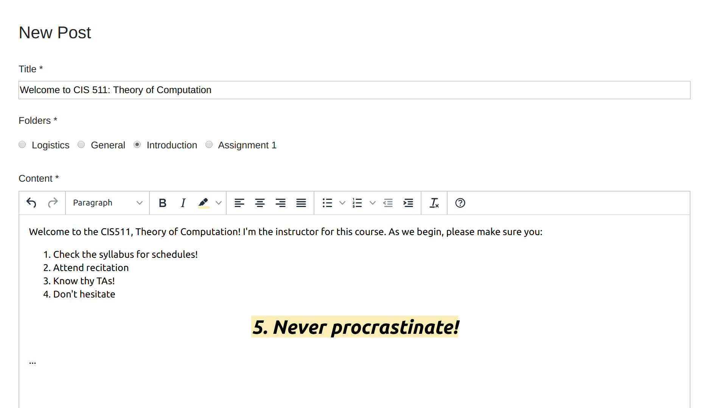

---

_Concourse is a web-based collaborative course communication platform designed to bring the best online interaction experience for students and instructors._

[Concourse is live!](http://dllqc5uhws7ff.cloudfront.net/home)

This was submitted as project for a [hackathon](https://mcit-online-winter-2020.devpost.com/). Feel free to try the project or add a comment or like the project on [Devpost](https://devpost.com/software/concourse).

 

---

 

#### Inspiration
The idea for Concourse comes from some complaints from my classmates and I about [Piazza](https://piazza.com/about/story). I was learning the Spring framework after 591, so I thought this hackathon would be a great opportunity to apply what I learned. In this project, I redesign and make my own version of Piazza.

#### What it does
Concourse is a web-based collaborative course communication platform designed to bring the best online interaction experience for students and instructors.

Concourse aspires to make online course communication between students and instructors a pleasant experience. We want to be the [Slack](https://slack.com/about) for course communication, a platform that students and instructors alike would love to use. Our ultimate goal is to create an environment where students can get all their questions answered effectively.

#### How I built it
As for design, I began with the basic and essential features of Piazza. Then, I incorporated some features that can enhance user experience by learning from popular communities and forums, such as [Stack Overflow](https://stackoverflow.com/company) and [Reddit](https://www.redditinc.com/). 

The backend is powered with [Spring](https://spring.io/) deployed on AWS Elastic Beanstalk. The website is currently hosted on AWS S3 and distributed on AWS CloudFront.

The front-end is built with [Angular](https://angular.io/). I chose Angular as it uses Typescript and dependency injection, which is similar to Java and Spring architecture.

 

### Gallery

---

 

 

---

 

 

---

 

 

---

 

 

---

